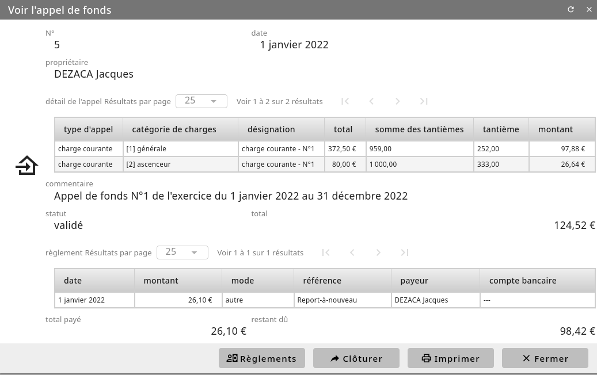

Les appels de fonds
===================

Pour créer un appel de fonds, cliquez sur le menu *Général/Copropriete/appels de fonds*.
Depuis cette liste des appels de fond, vous pouvez en créer un nouveau via le bouton "Ajouter".

Une fois avoir précisé la date et le descriptif de cette appel, une nouvelle fiche d'appel est créé.
Ajoutez dans cette fiche différentes élements d'appel. 
Sur chaqu'un vous préciser l'ensemble de lots associé à cet élement d'appel ainsi que le montant.

Enfin, pour finaliser l'appel de fond, cliquez sur "Valider"
L'ensemble des copropriétaires se voient alors associés à une nouvelle fiche d'appel de fond.
Les montants de chaques éléments précédement saisi sont modifiés en fonction du ratio de l'ensemble que possède chaque copropriétaire. 