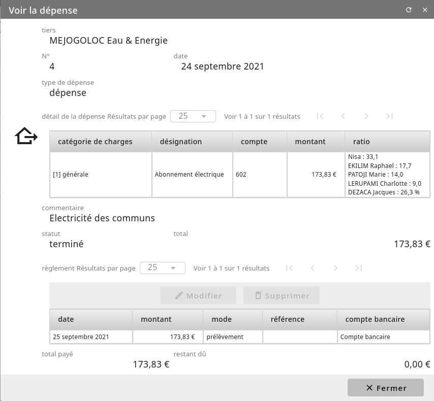

Les dépenses
============

Pour gérer une dépense de copropriété, cliquez sur le menu *Général/Copropriete/dépenses*.
Depuis cette liste des dépenses, vous pouvez en créer un nouveau via le bouton "Ajouter".

Une fois avoir précisé la date et le descriptif de cette dépense, une nouvelle fiche d'appel est créé.
Commencez par indiquer le fournisseur de votre nouvelle dépense. Celui-ci doit être un tiers référencé.
Comme pour les appel de fonds, ajoutez dans cette fiche différentes élements de dépense. Sur chaqu'un vous préciser l'ensemble de lots associé ainsi que son montant.

Enfin, pour finaliser la dépense, cliquez sur "Valider"
Un certain nombre d'action sont alors réalisé en comptabilité:
 - L'écriture de dépense est généré en brouillard.
 - Pour chaque copropriétaire, une ventillation de cette dépense est réalisé en fonction de leurs ratio de l'ensemble que possède chaque copropriétaire.

Depuis cette fiche de dépense, vous pouvez aussi entrer les réglements de votre fournisseur.
Une écriture correspondante sera également généré. 