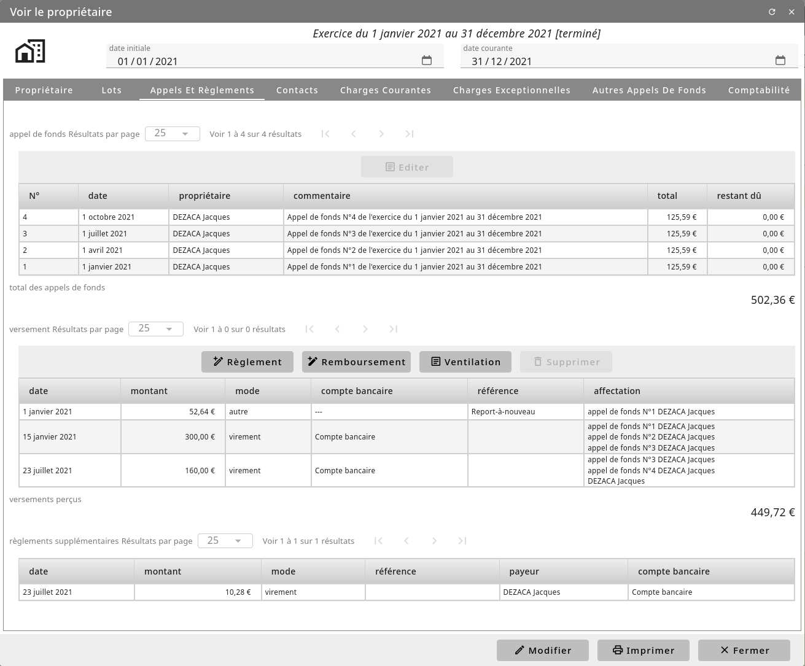

Le payements des copropriétaires
================================

Suite à un appel de fond, les copropriétaires transmettent leurs payements au syndic.
Pour le saisir, allez dans la fiche de tiers du copropriétaire depuis la liste des copropriétaire de *Général/Copropriété/Les ensembles et les coproprietaires*.

Ajoutez alors un payement en précisant la date, le montant, un référence de payement (comme le numéro de chèque) ainsi que le compte comptable à imputer.
Les écritures en comptabilité sont alors automatiquement réalisé en brouillard.
La situation du copropriétaire est également mis à jours. 