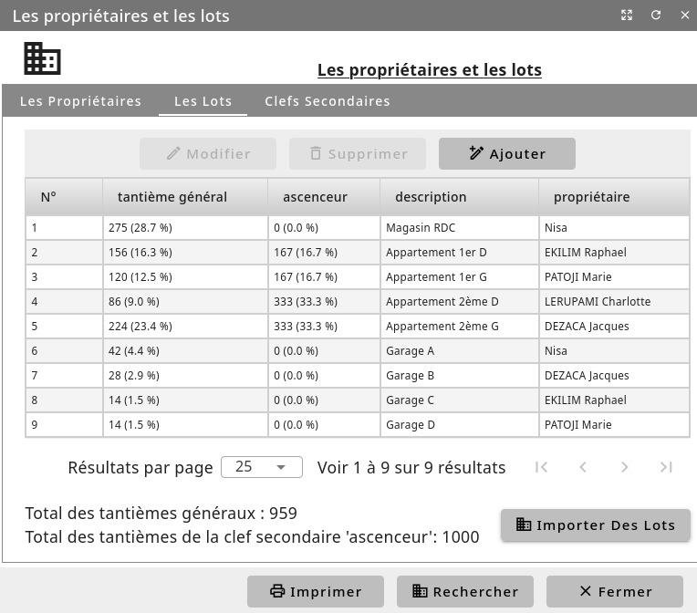

Les ensembles de lots
=====================

Pour décrire les biens que possède chaque copropriétaires et ainsi permettre de répartir les charges au mieux, cliquez sur le menu *Général/Copropriété/Les ensembles et les copropriétaires*.

Les ensembles
-------------

Un ensemble de lots est un groupe réunissant des copropriétaires possédant une cote part de celui-ci.
Il est interessant de définir plusieurs lot de nature différent, car les frais inérants à la copropriété sont différents suivant la nature des possetions: les garages, les différents escaliers ou bloque de batiments, ...
Ajoutez vos ensembles de lots à votre copropriété: vous devez leur définir un budget prévisionnel annuel, un code comptable d'assignation d'appel de font et éventuellement un code analytique. C'est deux dernier point peuvent vous aider à analyser votre comptabilité en fonction des différents ensembles de lots.

Les copropriétaires
-------------------

Ajoutez vos copropriétaires a ces lots.
Comptablement, un copropriétaire est égalemet un tiers comptable possédant un compte sociétaire (classe '45').
Par défaut, tous les copropriétaires apparaissent dans tous vos ensembles avec une cote part à zéro dans chacun des lots précédements créer.
Vous pouvez également voir ici un résumé de la situation financière de chacun des copropriétaires.

La répartition
--------------

Editez chaque ensemble pour modifier ce taux.